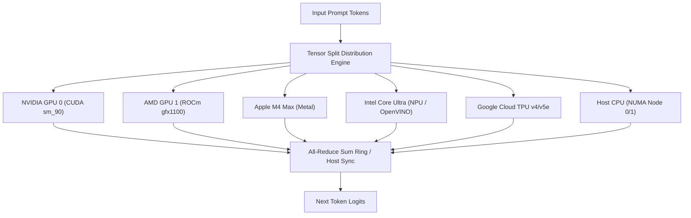

# Heterogeneous Multi-Device Hardware & Advanced KV Cache Systems

## Overview

`Oxide-Tech-LLM-Engine` provides high-performance heterogeneous device orchestration and hierarchical KV cache management across asymmetric hardware clusters.

---

## 1. Heterogeneous Multi-Device Tensor Splitting (`crates/oxide-engine/src/tensor_split.rs`)

Oxide supports partitioning model weights and activations across arbitrary combinations of different hardware architectures within the same inference pipeline:

### Supported Hardware Accelerators
- `NvidiaCuda` (CUDA 12.x / PTX / Blackwell NVFP4)
- `RocmAmd` (ROCm 6.x / HIP / MI300X / RDNA3)
- `MetalApple` (Apple Silicon M1/M2/M3/M4 AMX + Metal Shading Language)
- `IntelNpuVpu` (Intel Lunar Lake / Arrow Lake NPU & Arc B580)
- `GoogleTpu` (Cloud TPU v4 / v5e XLA HLO)
- `QualcommSnapdragon` (Hexagon NPU QNN)
- `RockchipRknn` (RK3588 NPU)
- `HailoAi` (Hailo-8 / Hailo-15H)
- `NumaCpuNode` (AVX-512 / AMX / ARM NEON multi-socket NUMA distribution)

### Proportional Memory Partitioning
The engine automatically partitions layer matrices and token slices according to each device's available VRAM/SRAM and memory bandwidth:
$$\text{SliceSize}_d = \left\lfloor N \cdot \frac{\text{VRAM}_d}{\sum_k \text{VRAM}_k} \right\rfloor$$

---

## 2. Advanced KV Cache Operations (`crates/oxide-alloc/src/kv_advanced.rs`)

### A. Context Shifting (Sliding Window with Prompt Preservation)
- When conversation context exceeds maximum sequence length $L_{\max}$, standard sliding windows discard the critical system prompt.
- **Oxide Context Shifter**: Preserves the first $N_{\text{prefix}}$ prompt tokens intact in Tier 1 VRAM, and slides the trailing window across the most recent $(L_{\max} - N_{\text{prefix}})$ tokens, automatically adjusting token position IDs in RoPE embeddings.

---

### B. Prompt Caching (Prefix Subtree Hashing)
- Computes 64-bit FNV-1a hashes over prompt token sequences in chunked 32-token blocks.
- Matching prompt prefixes are retrieved immediately from host RAM or NVMe cache tables without re-executing GPU prefill matrix multiplications, yielding up to $10\times$ TTFT (Time-To-First-Token) latency reduction.

---

### C. On-The-Fly KV Cache Quantization
Dynamically compresses Key and Value matrices in device memory to lower VRAM requirements during long decoding runs:
- `FP16`: 16-bit half-precision baseline.
- `Q8_0`: 8-bit integer block quantization with per-32-token scales ($2\times$ VRAM savings).
- `Q4_0`: 4-bit integer block quantization ($3.8\times$ VRAM savings).
- `FP8 (E4M3 / E5M2)`: 8-bit floating-point Tensor Core native caching.
- `INT4`: 4-bit packed nibble caching for extreme context lengths ($128\text{k}+$ tokens).

---

### D. KV Cache Dumping & Reloading
- **Zero-Copy Container (`KvCacheDumpContainer`)**: Serializes active sequence KV state (layer tensors, token indices, position embeddings, and quantization descriptors) to NVMe or remote storage.
- **Fast Session Resumption**: Enables pausing long multi-turn sessions, checkpointing agent memory states, and reloading without re-evaluating prompt tokens.
